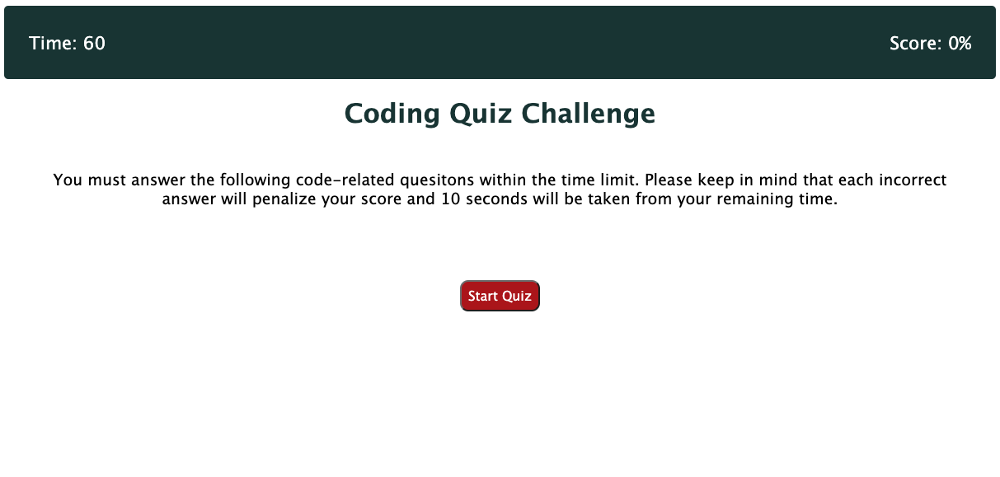
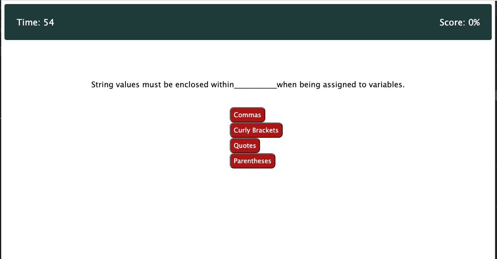
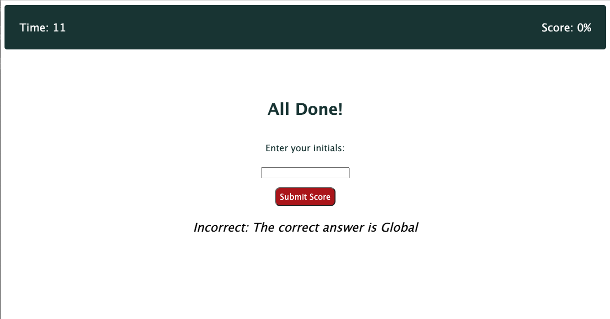
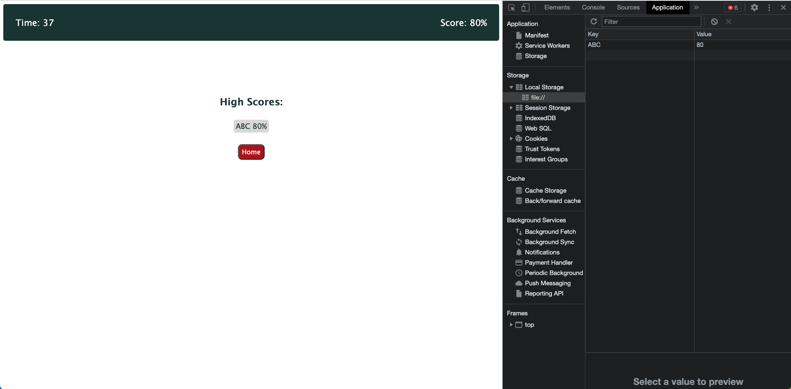

# Project: Timed Code Quiz

## Project Description: Create a timed quiz testing coding aptitude

- The goal of this project was to create a timed quiz application that allows a user to test their knowlede of JavaScript and save their score to locals storage score using their initials as key to pulling the score value.  20 points are added for each correctly answered question and 10 seconds is deducted from remaining time for each incorrect answer.

- The app runs in the browser and features JavaScript and dynamically updated HTML content and CSS styling.

- After completing the quiz and entering initials, the user can see the saved list of user initials/scores.  A home button at the end will refresh the quiz.

## User Story

- AS A coding boot camp student
- I WANT to take a timed quiz on JavaScript fundamentals that stores high scores
- SO THAT I can gauge my progress compared to my peers

## Acceptance Criteria

- GIVEN I am taking a code quiz
- WHEN I click the start button
- THEN a timer starts and I am presented with a question
- WHEN I answer a question
- THEN I am presented with another question
- WHEN I answer a question incorrectly
- THEN time is subtracted from the clock
- WHEN all questions are answered or the timer reaches 0
- THEN the game is over
- WHEN the game is over
- THEN I can save my initials and score

## Screenshots of Deployed Application

## Installation & Usage

Installation & usage is simply through loading the public url into your browswer search bar and using the links to navigate.

## Links 

Link to deployed site:
https://altb22.github.io/Timed_Code_Quiz

Link to GitHub Repository:
https://github.com/AltB22/Timed_Code_Quiz

## Credits

Built by William Massie in collaboration and guidance from UC Berkeley Ext Coding Boot Camp students and staff. 

## License

MIT License

Copyright (c) 2023 William Massie

Permission is hereby granted, free of charge, to any person obtaining a copy
of this software and associated documentation files (the "Software"), to deal
in the Software without restriction, including without limitation the rights
to use, copy, modify, merge, publish, distribute, sublicense, and/or sell
copies of the Software, and to permit persons to whom the Software is
furnished to do so, subject to the following conditions:

The above copyright notice and this permission notice shall be included in all
copies or substantial portions of the Software.

THE SOFTWARE IS PROVIDED "AS IS", WITHOUT WARRANTY OF ANY KIND, EXPRESS OR
IMPLIED, INCLUDING BUT NOT LIMITED TO THE WARRANTIES OF MERCHANTABILITY,
FITNESS FOR A PARTICULAR PURPOSE AND NONINFRINGEMENT. IN NO EVENT SHALL THE
AUTHORS OR COPYRIGHT HOLDERS BE LIABLE FOR ANY CLAIM, DAMAGES OR OTHER
LIABILITY, WHETHER IN AN ACTION OF CONTRACT, TORT OR OTHERWISE, ARISING FROM,
OUT OF OR IN CONNECTION WITH THE SOFTWARE OR THE USE OR OTHER DEALINGS IN THE
SOFTWARE.